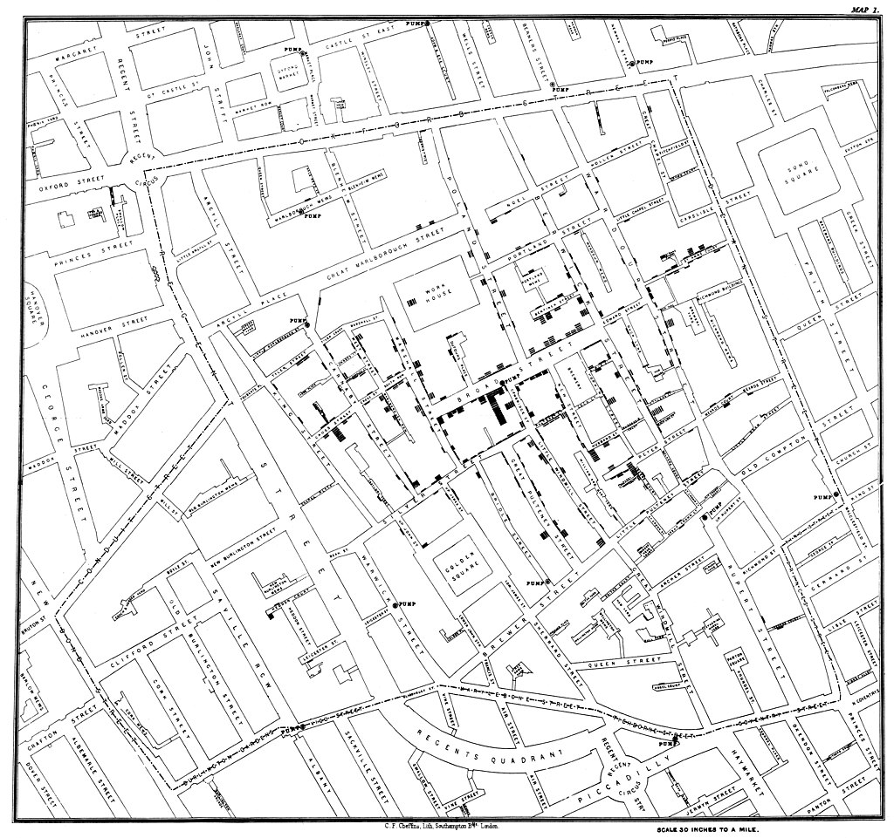

---
# Please do not edit this file directly; it is auto generated.
# Instead, please edit 00-intro.md in _episodes_rmd/
title: "Before we Start"
teaching: 25
exercises: 15
questions:
- "How to find your way around RStudio?"

objectives:
- "Install latest version of R."
keypoints:
- "Use RStudio to write and run R programs."

source: Rmd
---

# Strukturen

1. hvad skal vi overveje når vi visualiserer

Hvad vil vi vise

Hvilke data skal vi bruge

Målgruppe

Æstetik vs information

1.5 Hvilke visuelle elementer har vi at arbejde med?

Position

Længde

Areal

Volumen

Form

Vinkel

Farve

Animation

2. Hvordan oversættes det til visuelle elementer?

3. faldgruber

# Andet

Chart junk

data til blæk forhold

## Why are we visualising data? ##

We visualise data for several purposes. They can be broken down to smaller 
purposes, but the main categories are:

Communicating information

Discovering patterns

In communication of information, we have a result, some information or 
relationships between data that we want to present to an audience. The goal is
to tell our audience about something.

An earlier stage of the process is when we use visualisation of data, to discover 
what is happening in our data. We visualise data to draw on the pattern 
recognition our brain is equipped with.

A classical example of the value of visualising data is the 
[https://en.wikipedia.org/wiki/1854_Broad_Street_cholera_outbreak](work done by John Snow)
during an outbreak of cholera in London in 1854. Carefull collection of data on
where people afflicted by cholera were living resulted in this map:

Stacked rectangles places shows the clusters of cholera cases. Quite close to 
the largest rectangles we find a water pump, at the intersection of Broad Street
and Cambridge Street. That pump was the source of the outbreak, that killed 616 
people. It was located less than 1 meter from a cesspit that was leaking.

Visualising the number of cases made it relatively easy to identify the source 
and close it down.

In this course we do discuss the different ways to visualise data. We cover a 
wide range of graph types, their strenghts and weaknesses, issues that we need
to consider when making choices about colours and scales and pittfalls in 
visualising data. 

We do not discuss how to actually make the plots. The code, where used, 
is available at this site, but is left to the interested student. 

<figure>

<figcaption>
RStudio extends what R can do, and makes it easier to write R code and interact
with R. <a href="https://unsplash.com/photos/D19rXKDUPYM">Left photo credit</a>; <a href="https://unsplash.com/photos/Wec3M4dY_LE">Right photo credit</a>.
</figcaption>
</figure>


