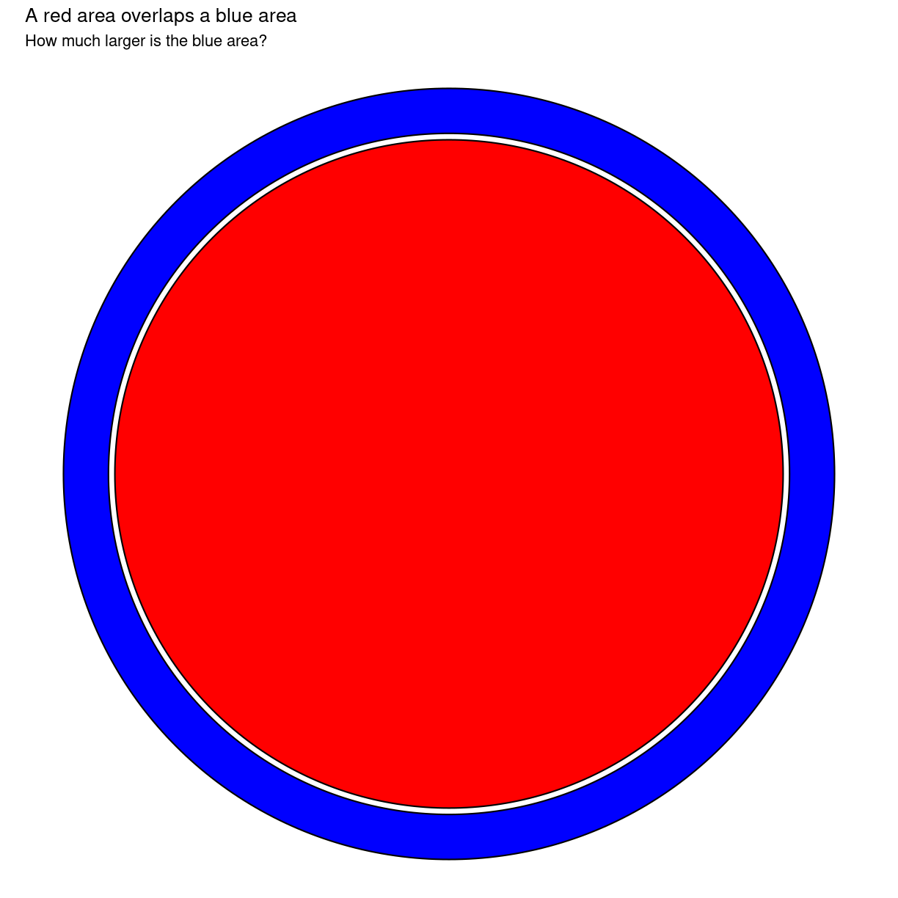

---
# Please do not edit this file directly; it is auto generated.
# Instead, please edit 01-general-principles.md in _episodes_rmd/
title: "Introduction to datavisualisation"
teaching: 50
exercises: 30
questions:
- "What data types are available in R?"
- "What is an object?"
- "How can values be initially assigned to variables of different data types?"
- "What arithmetic and logical operators can be used?"
- "How can subsets be extracted from vectors?"
- "How does R treat missing values?"
- "How can we deal with missing values in R?"
objectives: 
- "Define the following terms as they relate to R: object, assign, call, function, arguments, options."
- "Assign values to objects in R."
- "Learn how to name objects."
- "Use comments to inform script."
- "Solve simple arithmetic operations in R."
- "Call functions and use arguments to change their default options."
- "Inspect the content of vectors and manipulate their content."
- "Subset and extract values from vectors."
- "Analyze vectors with missing data."
keypoints:
- "Access individual values by location using `[]`."
- "Access arbitrary sets of data using `[c(...)]`."
- "Use logical operations and logical vectors to access subsets of data."
source: Rmd
---


Først og fremmest - hvem er din målgruppe, hvad er det du vil vise? Hvad er 
formålet med visualilseringen?


Herunder er der stadig en del kode og andet skrammel, der ikke er fjernet endnu.


data + symboler + encoding + anotation = visualisering


Tufte suggests six fundamental principles of design: show comparisons, show causality, use multivariate data, completely integrate modes (like text, images, numbers), establish credibility, and focus on content. 

Hvad har vi at gøre godt med?
Shape
Color
Size
Area
Volume
Length
Angle
Position
Direction
Density


Vise andre sammenhænge og mønstre, så de kan forstå data. Der er både et 
eksplorativt element, hvor vi bruger visualiseringer til at opdage mønstre
og et kommunikativt element hvor vi bruger visualiseringer til at vise mønstre.
https://www.visualcapitalist.com/data-visualization-cholera/

Et eksempel:
https://twitter.com/AndrewDessler/status/1429099366250434562?s=03


> ## Objects vs. variables
>
> What are known as `objects` in `R` are known as `variables` in many other
> programming languages. Depending on the context, `object` and `variable` can
> have drastically different meanings. However, in this lesson, the two words
> are used synonymously. For more information see:
> [https://cran.r-project.org/doc/manuals/r-release/R-lang.html#Objects](https://cran.r-project.org/doc/manuals/r-release/R-lang.html#Objects)
{: .callout}


> ## Exercise
> 
> What do you think is the current content of the object `area_acres`? 123.5 or
> 6.175?
>
> > ## Solution
> >
> > The value of `area_acres` is still 6.175 because you have not
> > re-run the line `area_acres <- 2.47 * area_hectares` since
> > changing the value of `area_hectares`.
> {: .solution}
{: .challenge}


> ## Exercise
>
> Create two variables `r_length` and `r_width` and assign them values. It should be noted that, 
> because `length` is a built-in R function, R Studio might add "()" after you type `length` and 
> if you leave the parentheses you will get unexpected results. 
> This is why you might see other programmers abbreviate common words.
> Create a third variable `r_area` and give it a value based on the current values of `r_length` 
> and `r_width`.
> Show that changing the values of either `r_length` and `r_width` does not affect the value of 
> `r_area`.
> 
> > ## Solution
> > 
> > 
> > ~~~
> > r_length <- 2.5
> > r_width <- 3.2
> > r_area <- r_length * r_width
> > r_area
> > ~~~
> > {: .language-r}
> > 
> > 
> > 
> > ~~~
> > [1] 8
> > ~~~
> > {: .output}
> > 
> > 
> > 
> > ~~~
> > # change the values of r_length and r_width
> > r_length <- 7.0
> > r_width <- 6.5
> > # the value of r_area isn't changed
> > r_area
> > ~~~
> > {: .language-r}
> > 
> > 
> > 
> > ~~~
> > [1] 8
> > ~~~
> > {: .output}
> > 
> {: .solution}
{: .challenge}


> ## Exercise
>
> Type in `?round` at the console and then look at the output in the Help pane.
> What other functions exist that are similar to `round`?
> How do you use the `digits` parameter in the round function?
{: .challenge}


> ## Exercise
>
>
> We’ve seen that atomic vectors can be of type character, numeric (or double),
>   integer, and logical. But what happens if we try to mix these types in a
>   single vector?
>
> > ## Solution
> >
> > R implicitly converts them to all be the same type.
> {: .solution}
>
> What will happen in each of these examples? (hint: use `class()`
> to check the data type of your objects):
>
>  
>  ~~~
>  num_char <- c(1, 2, 3, "a")
>  num_logical <- c(1, 2, 3, TRUE)
>  char_logical <- c("a", "b", "c", TRUE)
>  tricky <- c(1, 2, 3, "4")
>  ~~~
>  {: .language-r}
>
>
> Why do you think it happens?
>
> > ## Solution
> >
> >  Vectors can be of only one data type. R tries to
> > convert (coerce) the content of this vector to find a "common
> > denominator" that doesn't lose any information.
> {: .solution}
>
>
> How many values in `combined_logical` are `"TRUE"` (as a character) in the
> following example:
>
> 
> ~~~
> num_logical <- c(1, 2, 3, TRUE)
> char_logical <- c("a", "b", "c", TRUE)
> combined_logical <- c(num_logical, char_logical)
> ~~~
> {: .language-r}
> &nbsp;
>
> > ## Solution
> >
> > Only one. There is no memory of past data types, and the coercion
> > happens the
> > first time the vector is evaluated. Therefore, the `TRUE` in
> > `num_logical`
> > gets converted into a `1` before it gets converted into `"1"` in
> > `combined_logical`.
> {: .solution}
>
> You've probably noticed that objects of different types get
>   converted into a single, shared type within a vector. In R, we
>   call converting objects from one class into another class
>   _coercion_. These conversions happen according to a hierarchy,
>   whereby some types get preferentially coerced into other
>   types. Can you draw a diagram that represents the hierarchy of how
>   these data types are coerced?
>
{: .challenge}


> ## Exercise
>
> 1. Using this vector of rooms, create a new vector with the NAs removed.
>
>     ```r
>     rooms <- c(1, 2, 1, 1, NA, 3, 1, 3, 2, 1, 1, 8, 3, 1, NA, 1)
>     ```
> 2. Use the function `median()` to calculate the median of the `rooms` vector.
>
> 3. Use R to figure out how many households in the set use more than 2 rooms for sleeping.
>
> > ## Solution
> > 
> > ~~~
> > rooms <- c(1, 2, 1, 1, NA, 3, 1, 3, 2, 1, 1, 8, 3, 1, NA, 1)
> > rooms_no_na <- rooms[!is.na(rooms)]
> > # or
> > rooms_no_na <- na.omit(rooms)
> > # 2.
> > median(rooms, na.rm = TRUE)
> > ~~~
> > {: .language-r}
> > 
> > 
> > 
> > ~~~
> > [1] 1
> > ~~~
> > {: .output}
> > 
> > 
> > 
> > ~~~
> > # 3.
> > rooms_above_2 <- rooms_no_na[rooms_no_na > 2]
> > length(rooms_above_2)
> > ~~~
> > {: .language-r}
> > 
> > 
> > 
> > ~~~
> > [1] 4
> > ~~~
> > {: .output}
> {: .solution}
{: .challenge}


## noter og andet godt ##

Plottyper:

•	Strukturtegning
•	Kort
•	Diagram
•	Barplot
•	Scatterplot
o	Bobleplot
•	Linieplot
•	Boxplot
•	Violinplot
•	Heatmap
•	Dendrogramm

”Farlige” plots:
•	Lagkage
•	Wordcloud
•	Polygonpakning

Dernæst:
Hvad: 
Datatyper, antal, forhold, geografi, størrelser.
Men også - hvad katten vil du egentlig vise?
Og så vores skelnen mellem information og kunst.

Hvordan:
Position
Længder
Arealer
Vinkler
Retning/flow
Farver 
Geometriske former

Diagramtyper:
Do (til hvad)
Don't (hvorfor)

Afsluttende:
Eksempler på gode og dårlige visualiseringer.
Videre

Eksempler på gode og dårlige illustraioner:
Og hvorfor vi gør det!
Napoleons ruslandstogt (http://www.openculture.com/2019/07/napoleons-disastrous-invasion-of-russia-explained-in-an-1869-data-visualization.html)
Florence Nightingale: https://medium.com/nightingale/from-the-battlefield-to-basketball-a-data-visualization-journey-with-florence-nightingale-c39571686dfc
https://www.visualcapitalist.com/data-visualization-cholera/


~~~
library(tidyverse)
~~~
{: .language-r}


~~~
── Attaching packages ─────────────────────────────────────── tidyverse 1.3.1 ──
~~~
{: .output}


~~~
✔ ggplot2 3.3.5     ✔ purrr   0.3.4
✔ tibble  3.1.4     ✔ dplyr   1.0.7
✔ tidyr   1.1.3     ✔ stringr 1.4.0
✔ readr   2.0.1     ✔ forcats 0.5.1
~~~
{: .output}


~~~
── Conflicts ────────────────────────────────────────── tidyverse_conflicts() ──
✖ dplyr::filter() masks stats::filter()
✖ dplyr::lag()    masks stats::lag()
~~~
{: .output}


~~~
library(ggforce)

ggplot() +
  geom_circle(aes(x0 = 0, y0 = 0, r = 3), fill = "blue") +
    geom_circle(aes(x0 = 0, y0 = 0, r = 2.65), fill = "white") +
  geom_circle(aes(x0 = 0, y0 = 0, r = 2.6), fill = "red") +
  coord_fixed() +
  theme_void() +
  labs(title = "A red area overlaps a blue area",
       subtitle = "How much larger is the blue area?")
~~~
{: .language-r}


The red area is only 75% of the blue area.


~~~
# Change the filter to select February rather than January
nycflights <- filter(nycflights, month == 1)
~~~
{: .language-r}


~~~
Error in filter(nycflights, month == 1): object 'nycflights' not found
~~~
{: .error}


~~~
nycflights <- filter(nycflights, month == 2)
~~~
{: .language-r}


~~~
Error in filter(nycflights, month == 2): object 'nycflights' not found
~~~
{: .error}


> ## Exercise
>
>  
>  ~~~
>  interviews_plotting %>%
>      ggplot(aes(x = village, y = rooms)) +
>      geom_jitter(aes(color = respondent_wall_type),
>   		    alpha = 0.5,
>  		    width = 0.2,
>  		    height = 0.2)
>  ~~~
>  {: .language-r}
>  
>  
>  
>  ~~~
>  Error in ggplot(., aes(x = village, y = rooms)): object 'interviews_plotting' not found
>  ~~~
>  {: .error}
> How much larger
> > ## Solution
> > 
> > ~~~
> > 
> > 
> > 75%
> > ~~~
> > {: .language-r}
> > 
> > 
> > 
> > ~~~
> > Error: <text>:3:3: unexpected input
> > 2: 
> > 3: 75%
> >      ^
> > ~~~
> > {: .error}
> {: .solution}
{: .challenge}



