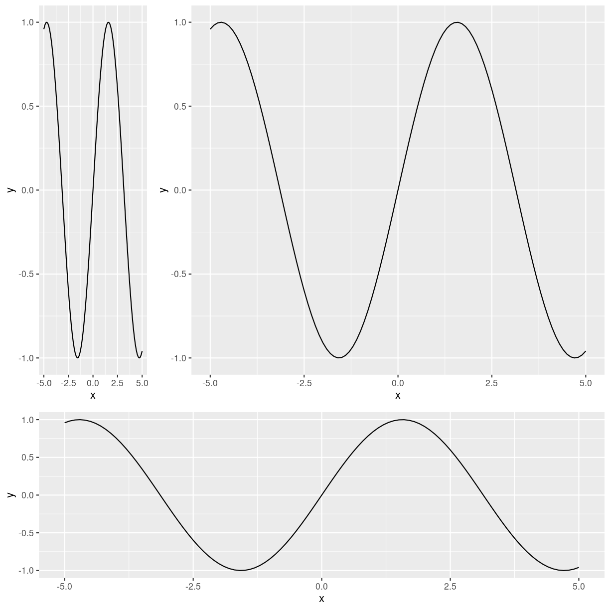

---
# Please do not edit this file directly; it is auto generated.
# Instead, please edit 02-axes.md in _episodes_rmd/
title: "Axes"
teaching: 50
exercises: 30
questions:
- "What is a data.frame?"
- "How can I read a complete csv file into R?"
- "How can I get basic summary information about my dataset?"
- "How can I change the way R treats strings in my dataset?"
- "Why would I want strings to be treated differently?"
- "How are dates represented in R and how can I change the format?"
objectives:
- "Describe what a data frame is."
- "Load external data from a .csv file into a data frame."
- "Summarize the contents of a data frame."
- "Subset and extract values from data frames."
- "Describe the difference between a factor and a string."
- "Convert between strings and factors."
- "Reorder and rename factors."
- "Change how character strings are handled in a data frame."
- "Examine and change date formats."
keypoints:
- "Use read_csv to read tabular data in R."
- "Use factors to represent categorical data in R."
source: Rmd
---

## Scaling of axes ## 

Her taler vi om akser, og deres betydning for visualiseringer

skalering er ret vigtig. Nedenstående tre plots har nøjagtigt samme data. Hvordan 
ser hældningerne ud på dem?

## Truncation of axes ## 

<figure>

<figcaption>
Image credit: <a href="https://github.com/allisonhorst/stats-illustrations">Allison Horst</a>
</figcaption>
</figure>

Nedenstående import af data beholder vi lidt endnu - piller vi ved den
crasher efterfølgende siders kode, og det må godt vente et par iterationer

~~~
library(tidyverse)
library(here)

interviews <- read_csv(
  here("data", "SAFI_clean.csv"), 
  na = "NULL")
~~~
{: .language-r}

Den her beholder vi foreløbig, som eksempel på hvordan vi indsætter noter

> ## Note
>
> `read_csv()` assumes that fields are delimited by commas. However, in several
> countries, the comma is used as a decimal separator and the semicolon (;) is
> used as a field delimiter. If you want to read in this type of files in R,
> you can use the `read_csv2` function. It behaves exactly like `read_csv` but
> uses different parameters for the decimal and the field separators. If you are
> working with another format, they can be both specified by the user. Check out
> the help for `read_csv()` by typing `?read_csv` to learn more. There is also
> the `read_tsv()` for tab-separated data files, and `read_delim()` allows you
> to specify more details about the structure of your file.
{: .callout}

Og den her beholder vi som eksempel på hvordan vi laver øvelser i det her system.

> ## Exercise
>
> 1. Create a tibble (`interviews_100`) containing only the data in
>    row 100 of the `interviews` dataset.
>
> 2. Notice how `nrow()` gave you the number of rows in the tibble?
>
>      * Use that number to pull out just that last row in the tibble.
>      * Compare that with what you see as the last row using `tail()` to make
>        sure it's meeting expectations.
>      * Pull out that last row using `nrow()` instead of the row number.
>      * Create a new tibble (`interviews_last`) from that last row.
>
> 3. Using the number of rows in the interviews dataset that you found in
>    question 2, extract the row that is in the middle of the dataset. Store
>    the content of this middle row in an object named `interviews_middle`.
>    (hint: This dataset has an odd number of rows, so finding the middle is a
>    bit trickier than dividing n_rows by 2. Use the median( ) function and what
>    you've learned about sequences in R to extract the middle row!
>
> 4. Combine `nrow()` with the `-` notation above to reproduce the behavior of
>    `head(interviews)`, keeping just the first through 6th rows of the
>    interviews dataset.
>
> > ## Solution
> >
> > 
> > ~~~
> > ## 1.
> > interviews_100 <- interviews[100, ]
> > ## 2.
> > # Saving `n_rows` to improve readability and reduce duplication
> > n_rows <- nrow(interviews)
> > interviews_last <- interviews[n_rows, ]
> > ## 3.
> > interviews_middle <- interviews[median(1:n_rows), ]
> > ## 4.
> > interviews_head <- interviews[-(7:n_rows), ]
> > ~~~
> > {: .language-r}
> {: .solution}
{: .challenge}

Her sker der vist et eller andet med data - det lader vi lige overleve til
der er ryddet op i andre sider.

~~~
interviews$day <- day(dates)
~~~
{: .language-r}

~~~
Error in day(dates): could not find function "day"
~~~
{: .error}

~~~
interviews$month <- month(dates)
~~~
{: .language-r}

~~~
Error in month(dates): could not find function "month"
~~~
{: .error}

~~~
interviews$year <- year(dates)
~~~
{: .language-r}

~~~
Error in year(dates): could not find function "year"
~~~
{: .error}

~~~
interviews
~~~
{: .language-r}

~~~
# A tibble: 131 × 14
   key_ID village interview_date      no_membrs years_liv respondent_wall… rooms
    <dbl> <chr>   <dttm>                  <dbl>     <dbl> <chr>            <dbl>
 1      1 God     2016-11-17 00:00:00         3         4 muddaub              1
 2      1 God     2016-11-17 00:00:00         7         9 muddaub              1
 3      3 God     2016-11-17 00:00:00        10        15 burntbricks          1
 4      4 God     2016-11-17 00:00:00         7         6 burntbricks          1
 5      5 God     2016-11-17 00:00:00         7        40 burntbricks          1
 6      6 God     2016-11-17 00:00:00         3         3 muddaub              1
 7      7 God     2016-11-17 00:00:00         6        38 muddaub              1
 8      8 Chirod… 2016-11-16 00:00:00        12        70 burntbricks          3
 9      9 Chirod… 2016-11-16 00:00:00         8         6 burntbricks          1
10     10 Chirod… 2016-12-16 00:00:00        12        23 burntbricks          5
# … with 121 more rows, and 7 more variables: memb_assoc <chr>,
#   affect_conflicts <chr>, liv_count <dbl>, items_owned <chr>, no_meals <dbl>,
#   months_lack_food <chr>, instanceID <chr>
~~~
{: .output}


