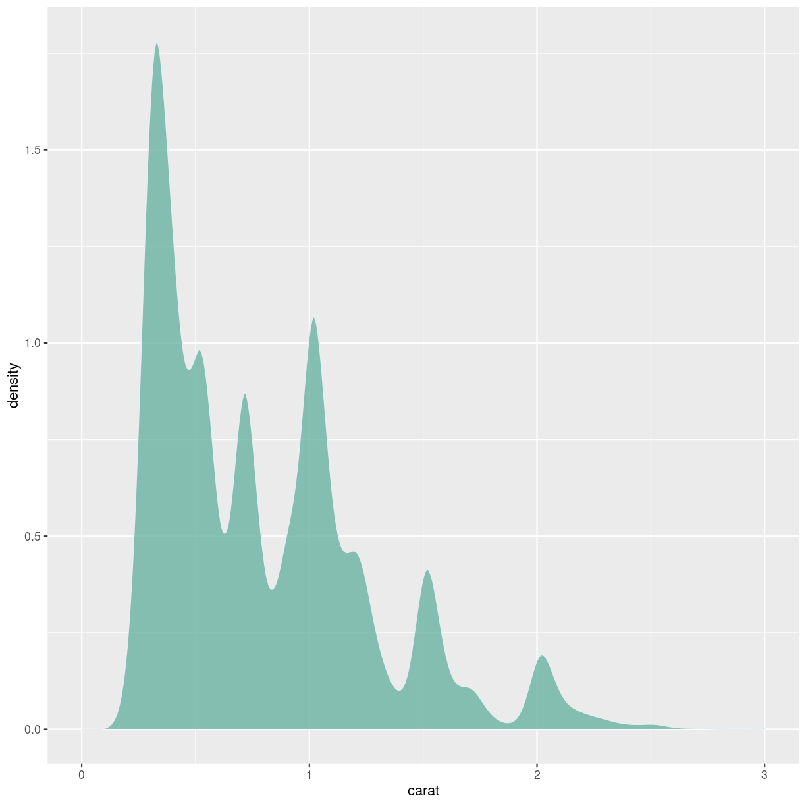
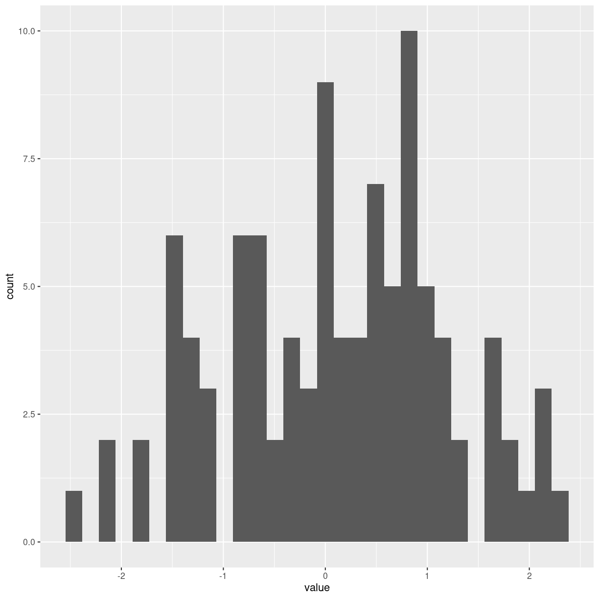
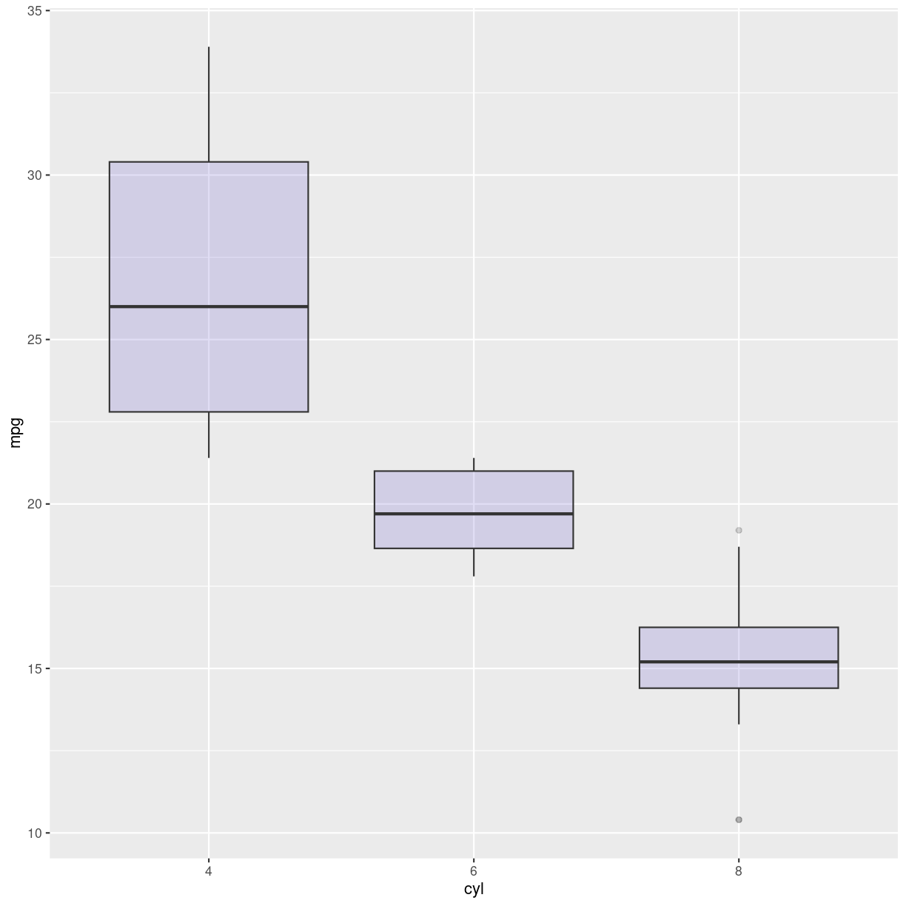
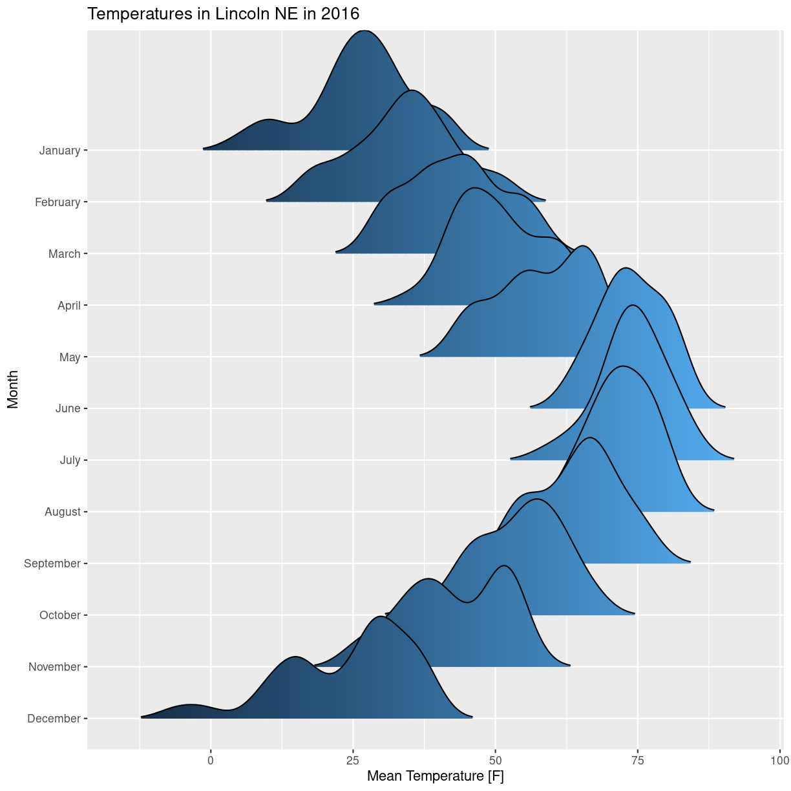
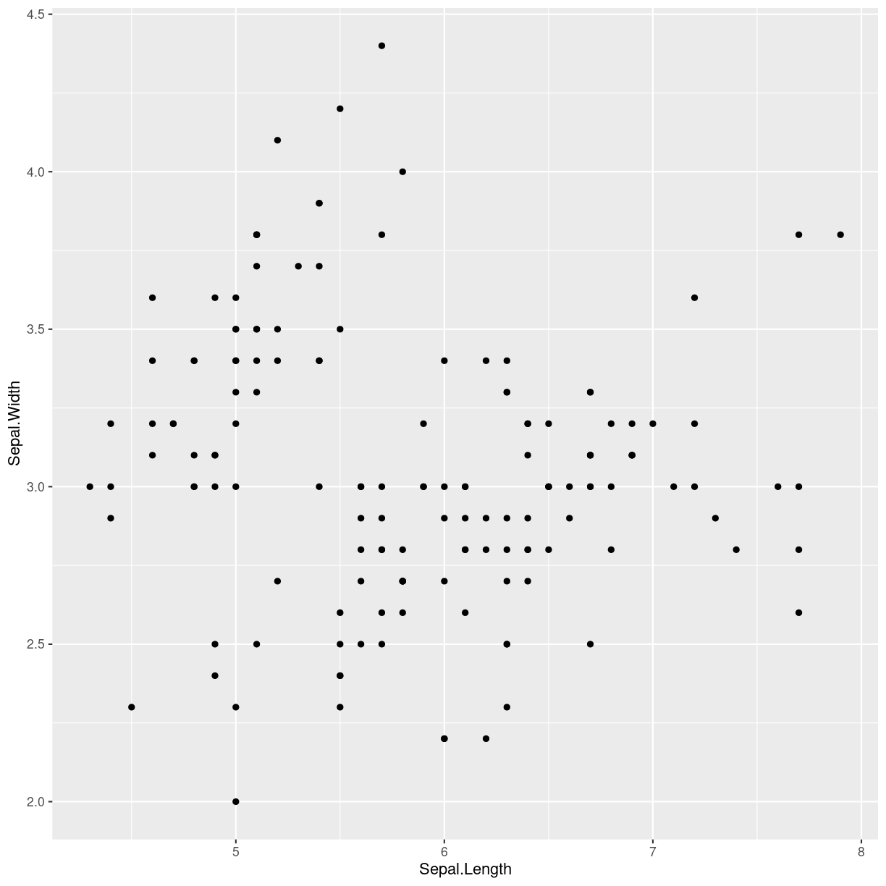
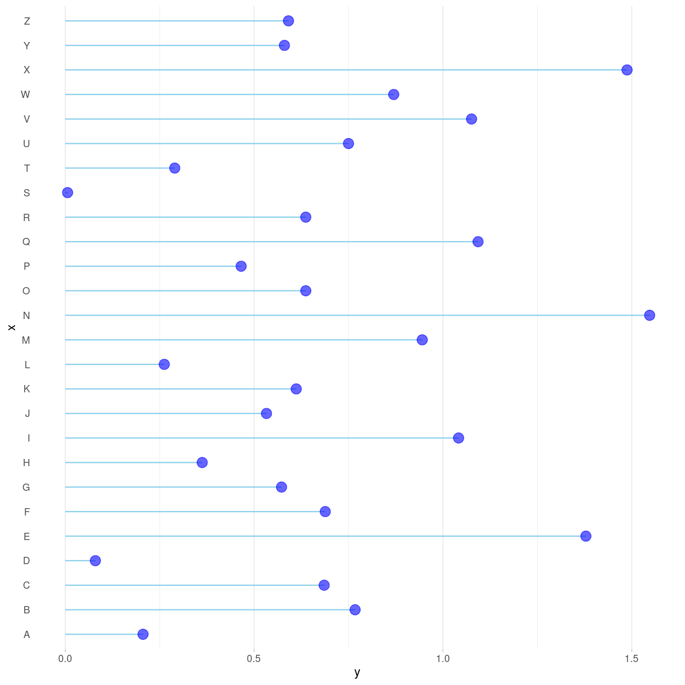
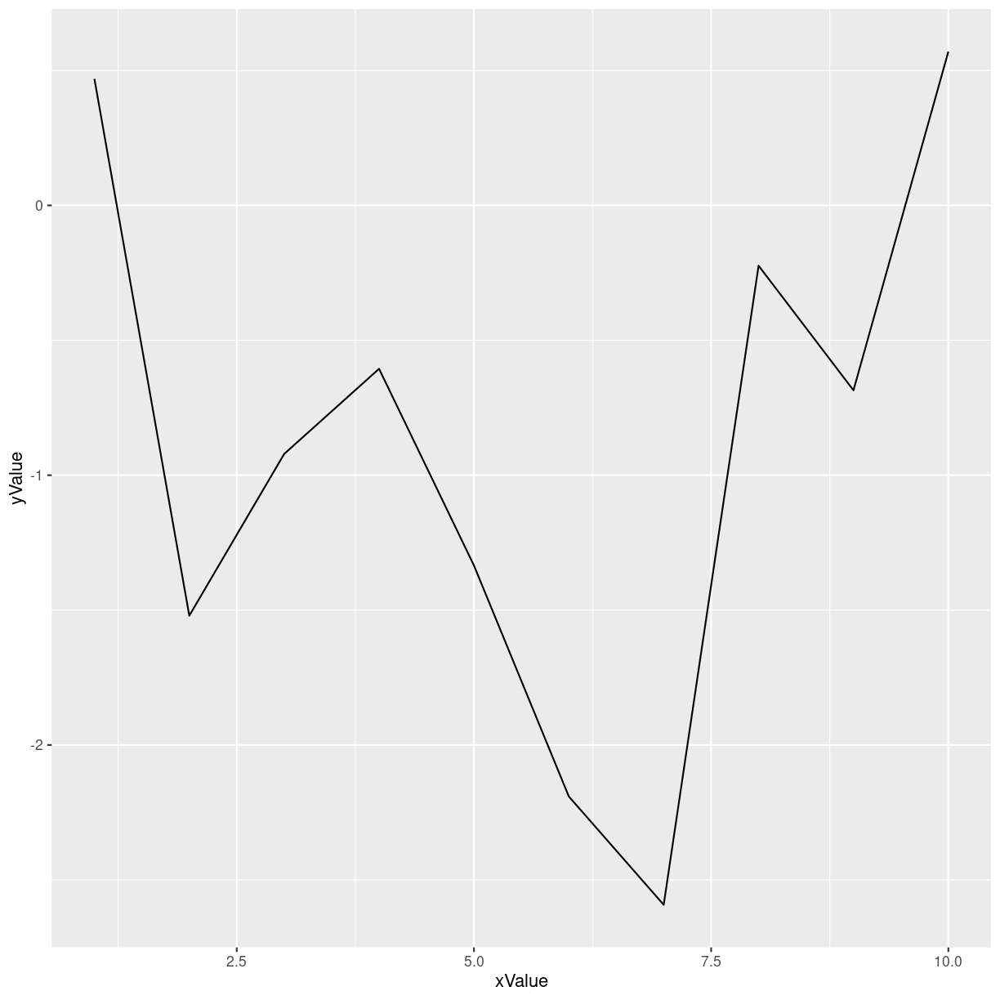
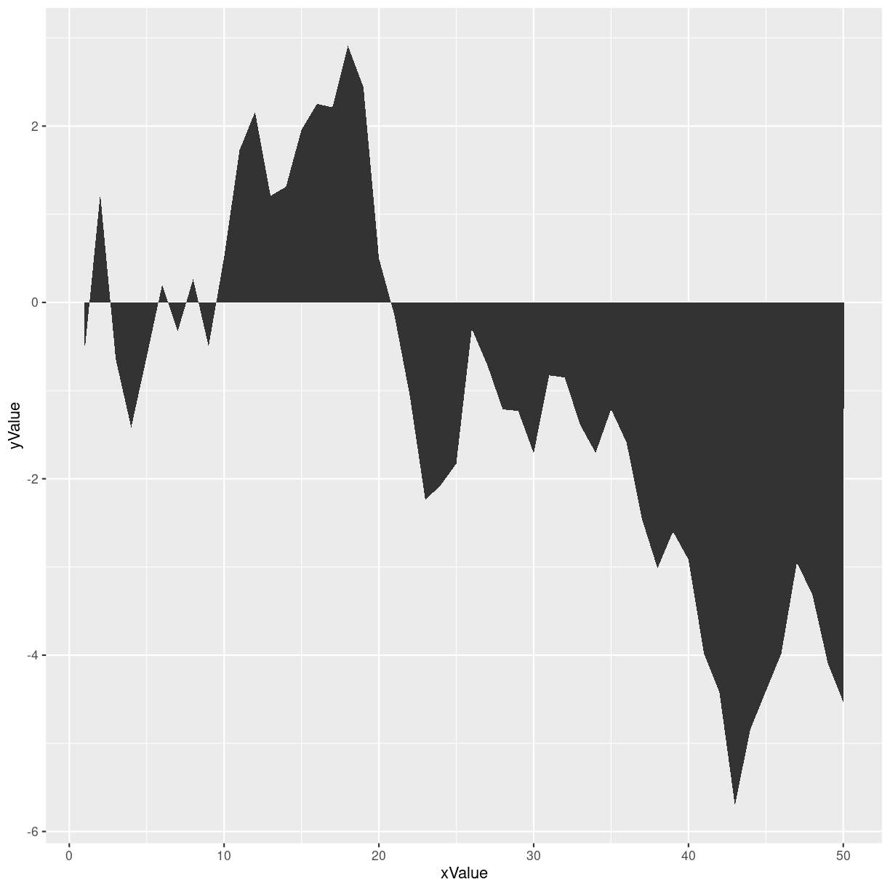

---
# Please do not edit this file directly; it is auto generated.
# Instead, please edit 06-types-of-plots.md in _episodes_rmd/
title: "types of plots"
teaching: 30
exercises: 15
questions:
- "What is JSON format?"

objectives:
- "Describe the JSON data format"
keypoints:
- "JSON is a popular data format for transferring data used by a great many Web based APIs"

source: Rmd
---

# gode til fordelinger

## violin

~~~
mpg$class = with(mpg, reorder(class, hwy, median))

mpg %>%
  ggplot( aes(x=class, y=hwy, fill=class)) + 
    geom_violin() +
    xlab("class") +
    theme_void() +
    theme(legend.position="none") +
    xlab("")
~~~
{: .language-r}

## density

~~~
Warning: Removed 32 rows containing non-finite values (`stat_density()`).
~~~
{: .warning}

## Histogram

~~~
`stat_bin()` using `bins = 30`. Pick better value with `binwidth`.
~~~
{: .output}

## Boxplot

## Ridgeline

~~~
Warning: The dot-dot notation (`..x..`) was deprecated in ggplot2 3.4.0.
ℹ Please use `after_stat(x)` instead.
~~~
{: .warning}

~~~
Picking joint bandwidth of 3.37
~~~
{: .output}

# Gode til korrelationer

## scatter
Basic scatterplot

alternativ:

## Heatmap

## Correlogram

## Bubble

## Connected scatter

## Density 2d

# Gode til ranking

## Barplot

If there is no natural order of the x-values, consider reordering 
by size:

## Spider/radarplot

## Wordcloud

## Parallel

## Lollipop

Grundlæggende et barchart. 

## Cirkulær barplot

# gode til at vise dele af en helhed

## grupperet og stakket barplot

## Treemap

## Doughnut

Lige så meget skrammel som lagkagediagrammer.

## Pie Chart

Men pie-charts er noget skrammel

~~~
library(patchwork)
data1 <- data.frame( name=letters[1:5], value=c(17,18,20,22,24) )
data2 <- data.frame( name=letters[1:5], value=c(20,18,21,20,20) )
data3 <- data.frame( name=letters[1:5], value=c(24,23,21,19,18) )
plot_pie <- function(data, vec){

ggplot(data, aes(x="name", y=value, fill=name)) +
  geom_bar(width = 1, stat = "identity") +
  coord_polar("y", start=0, direction = -1) +
  geom_text(aes(y = vec, label = rev(name), size=4, color=c( "white", rep("black", 4)))) +
  scale_color_manual(values=c("black", "white")) +
  theme(
    legend.position="none",
    plot.title = element_text(size=14),
    panel.grid = element_blank(),
    axis.text = element_blank(),
    legend.spacing=unit(0, "null")
  ) +
  xlab("") +
  ylab("")
  
}
a <- plot_pie(data1, c(10,35,55,75,93))
b <- plot_pie(data2, c(10,35,53,75,93))
c <- plot_pie(data3, c(10,29,50,75,93))
a + b + c
~~~
{: .language-r}

~~~
plot_bar <- function(data){
  ggplot(data, aes(x=name, y=value, fill=name)) +
    geom_bar( stat = "identity") +
    scale_color_manual(values=c("black", "white")) +
    theme(
      legend.position="none",
      plot.title = element_text(size=14),
      panel.grid = element_blank(),
    ) +
    ylim(0,25) +
    xlab("") +
    ylab("")
}

# Make 3 barplots
a <- plot_bar(data1)
b <- plot_bar(data2)
c <- plot_bar(data3)

# Put them together with patchwork
a + b + c
~~~
{: .language-r}

## Dendrogram

## Circular packing

# Good for showing evolution

## line plot

## Area

## Stacked area

## Streamchart

## time series

# Good for geograpical data

## Map

## Choropleth

## Hexbin map

## Cartogram

## Connection

## Bubble map

# Good for showing flow

## Chord diagram

## Network

## Sankey

## Arc diagram

## Edge Bundling

#


