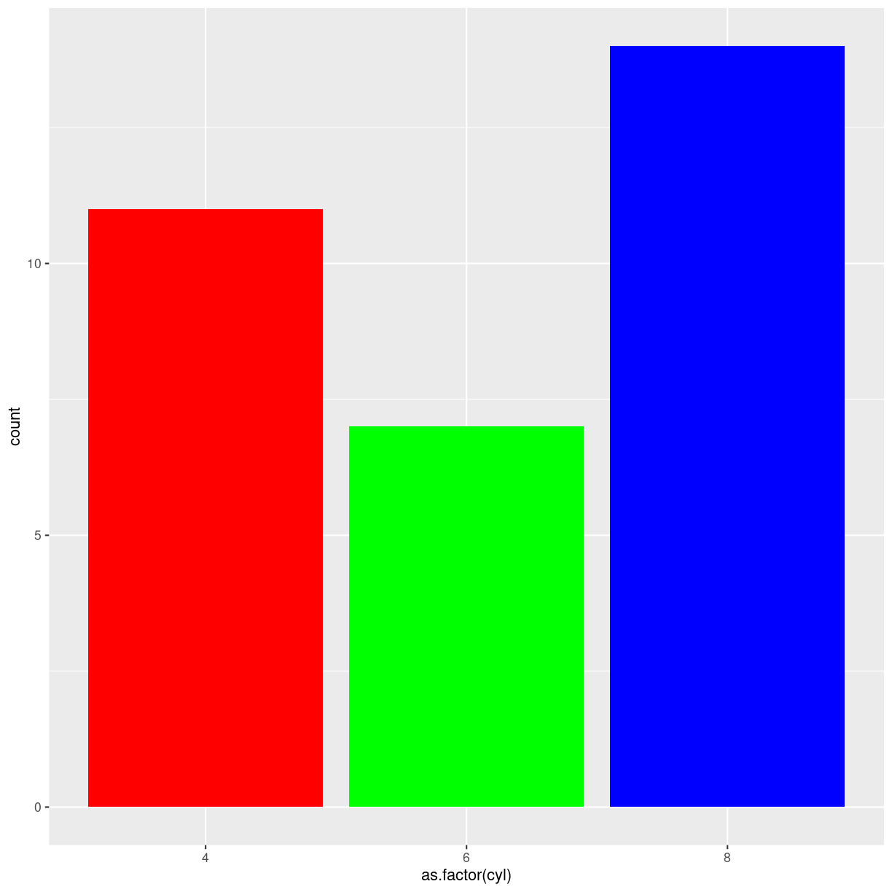

---
# Please do not edit this file directly; it is auto generated.
# Instead, please edit 06-types-of-plots.md in _episodes_rmd/
title: "Processing JSON data (Optional)"
teaching: 30
exercises: 15
questions:
- "What is JSON format?"

objectives:
- "Describe the JSON data format"
keypoints:
- "JSON is a popular data format for transferring data used by a great many Web based APIs"

source: Rmd
---

# gode til fordelinger

## violin

## density

## Histogram

## Boxplot

## Ridgeline

# Gode til korrelationer

## scatter
Basic scatterplot

alternativ:

## Heatmap

## Correlogram

## Bubble

## Connected scatter

## Density 2d

# Gode til ranking

## Barplot

If there is no natural order of the x-values, consider reordering 
by size:

## Spider/radarplot

## Wordcloud

## Parallel

## Lollipop

## Cirkulær barplot

# gode til at vise dele af en helhed

## grupperet og stakket barplot

## Treemap

## Doughnut

## Pie Chart

## Dendrogram

## Circular packing

# Good for showing evolution

## line plot

## Area

## Stacked area

## Streamchart

## time series

# Good for geograpical data

## Map

## Choropleth

## Hexbin map

## Cartogram

## Connection

## Bubble map

# Good for showing flow

## Chord diagram

## Network

## Sankey

## Arc diagram

## Edge Bundling

#


